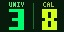

# ✨ Numerology Daily Display — Tidbyt App

A custom-built app for [Tidbyt](https://tidbyt.com), a retro-style 64×32 RGB LED pixel display, that shows daily numerology numbers at a glance.

---

## What is Tidbyt?

Tidbyt is a smart, internet-connected pixel display for your home or desk. It cycles through small apps — weather, clocks, sports scores, transit times — on a charming low-res LED screen. Developers can build custom apps using **Pixlet**, Tidbyt's open-source SDK, written in **Starlark** (a Python-like language).

---

## What is Numerology?

Numerology is the study of how numbers carry energetic meaning and influence. Every date can be reduced to a single digit (1–9) or a **master number** (11, 22, 33), each carrying its own theme for the day.

This app calculates two numbers:

### Universal Day Number

The Universal Day reflects the collective energy everyone shares on a given date. It's calculated by **adding all the digits of the full date together** and reducing to a single digit.

> **Example:** April 5, 2026 → 4 + 5 + 2 + 0 + 2 + 6 = 19 → 1 + 9 = **1** (a day for new beginnings and initiative)

### Calendar Day Number

The Calendar Day is a simpler personal rhythm — just the **day of the month reduced** to a single digit.

> **Example:** April 27 → 2 + 7 = **9** (a day for completion and reflection)

### Master Numbers (11, 22, 33)

When the reduction lands on 11, 22, or 33, the number is **not** reduced further. These master numbers carry amplified energy and display in **gold** on the Tidbyt.

---

## App Features

- **Side-by-side display** — Universal Day (left) and Calendar Day (right) with a vertical divider
- **Bold, legible numbers** — large font optimized for the 64×32 pixel screen
- **11 color themes** — selectable via Pixlet config
- **Master number highlighting** — 11, 22, and 33 render in gold across all themes
- **Automatic daily refresh** — GitHub Actions pushes updated numbers every night at 12:01 AM ET

---

## Color Themes

| Theme | Vibe |
|-------|------|
| Ocean | Cool blues & teals |
| Sunset | Warm oranges & golds |
| Mystic | Deep purples & gold |
| Forest | Fresh greens |
| Rose | Soft pinks |
| Ice | Clean whites & pale blues |
| Fire | Bold reds & orange |
| Lavender | Gentle purples |
| Gold | Rich golds & amber |
| Berry | Vibrant pinks & magenta |
| Midnight | Deep blues & indigo |

---

## How It Works

1. Every day at 12:01 AM ET, a GitHub Action runs automatically
2. It renders `numerology.star` using Pixlet, calculating that day's numbers
3. The rendered image is pushed to the Tidbyt device via the Tidbyt API
4. The app rotates alongside other installed apps (clock, weather, etc.)

---

## Tech Stack

- **Starlark** — Tidbyt's Python-like scripting language
- **Pixlet SDK** — Tidbyt's open-source app development toolkit
- **GitHub Actions** — automated daily rendering and device push
- **Tidbyt API** — delivers rendered images to the physical display

---

## Quick Reference: Number Meanings

| Number | Theme |
|--------|-------|
| 1 | New beginnings, independence, leadership |
| 2 | Cooperation, balance, partnerships |
| 3 | Creativity, joy, self-expression |
| 4 | Discipline, structure, hard work |
| 5 | Change, freedom, adventure |
| 6 | Love, family, responsibility |
| 7 | Introspection, spirituality, wisdom |
| 8 | Power, abundance, achievement |
| 9 | Completion, compassion, letting go |
| 11 | Intuition, spiritual insight, illumination |
| 22 | Master builder, big vision, manifestation |
| 33 | Master teacher, healing, selfless service |
